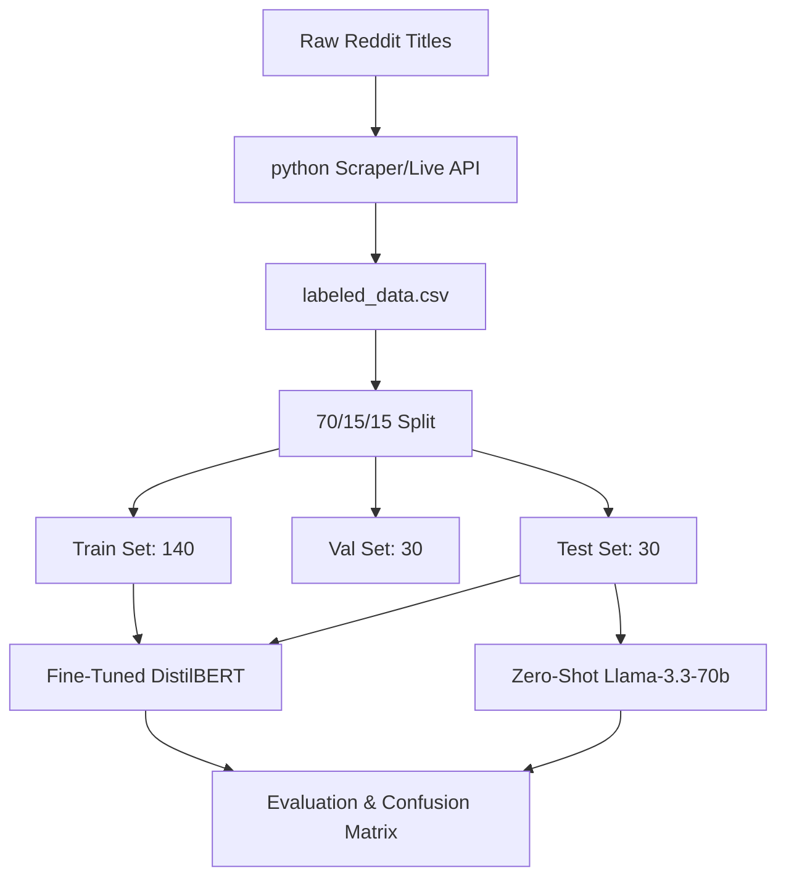

# r/nba Discourse Quality Classifier

A machine learning system that classifies post titles from the r/nba subreddit into distinct categories based on discourse depth and intent: `ANALYSIS` (deep analytical content), `HOT_TAKE` (subjective opinions and narrative debates), and `NEWS` (transactional updates and game highlights). 

This project benchmarks a zero-shot baseline model (Llama-3.3-70b-versatile via Groq) against a custom fine-tuned Transformer model (DistilBERT) trained on 200 manually annotated examples.

---

## 1. System Overview

### The Classification Task
Sports subreddits, particularly `r/nba`, suffer from a high ratio of noise to substance. This classifier acts as a quality filter, sorting posts into three mutually exclusive categories:
1.  **`ANALYSIS`**: High-quality, data-driven, tactical, or salary cap breakdowns.
2.  **`HOT_TAKE`**: Hyperbolic opinions, ranking debates, and community meta-discussion.
3.  **`NEWS`**: Official transaction reports, highlights, and game scores.

### Architecture & Pipeline

---

## 2. Evaluation Results

We evaluated both models on a locked test set of 30 examples. Below is the side-by-side comparison of their performance.

### Side-by-Side Model Comparison

| Metric | Zero-Shot Baseline (Llama-3.3-70b) | Fine-Tuned Model (DistilBERT) |
| :--- | :---: | :---: |
| **Overall Accuracy** | 0.467 | 0.533 |
| **Macro Average F1-Score** | 0.443 | 0.442 |

### Per-Class Metrics

#### 1. Zero-Shot Baseline (Llama-3.3-70b)
*   **Accuracy**: 46.7% (on 30/30 parseable responses)
*   **Per-Class Metrics**:
    *   **`ANALYSIS`**: Precision: `0.50` | Recall: `0.08` | F1-Score: `0.14` (Support: 12)
    *   **`HOT_TAKE`**: Precision: `0.71` | Recall: `0.62` | F1-Score: `0.67` (Support: 8)
    *   **`NEWS`**: Precision: `0.38` | Recall: `0.80` | F1-Score: `0.52` (Support: 10)

#### 2. Fine-Tuned Model (DistilBERT)
*   **Accuracy**: 53.3%
*   **Per-Class Metrics**:
    *   **`ANALYSIS`**: Precision: `0.52` | Recall: `1.00` | F1-Score: `0.68` (Support: 12)
    *   **`HOT_TAKE`**: Precision: `0.40` | Recall: `0.25` | F1-Score: `0.31` (Support: 8)
    *   **`NEWS`**: Precision: `1.00` | Recall: `0.20` | F1-Score: `0.33` (Support: 10)

### Confusion Matrix (Fine-Tuned DistilBERT)

| True \ Predicted | `ANALYSIS` | `HOT_TAKE` | `NEWS` |
| :--- | :---: | :---: | :---: |
| **`ANALYSIS`** | **12** | 0 | 0 |
| **`HOT_TAKE`** | 6 | **2** | 0 |
| **`NEWS`** | 5 | 3 | **2** |

---

## 3. Error Analysis & Reflection

### Directional Error Patterns
*   **`HOT_TAKE` $\rightarrow$ `ANALYSIS` (6 errors)**: The model predicted `ANALYSIS` for 6 out of 8 true `HOT_TAKE` items.
*   **`NEWS` $\rightarrow$ `ANALYSIS` (5 errors)**: The model predicted `ANALYSIS` for 5 out of 10 true `NEWS` items.
*   **`NEWS` $\rightarrow$ `HOT_TAKE` (3 errors)**: The model predicted `NEWS` as `HOT_TAKE` 3 times.

### In-Depth Failure Cases

#### Case 1: Editorial Summary Confusion
*   **Text**: `[The Guardian] 15 things we learned from the NBA playoffs and finals [Part 2]`
*   **True Label**: `HOT_TAKE`
*   **Predicted Label**: `ANALYSIS` (Confidence: `0.34`)
*   **Why it Failed**: The phrase "15 things we learned" mimics the structured format of a quantitative breakdown or summary report, which DistilBERT associated with the `ANALYSIS` tag. However, listicles of "things learned" from mainstream media are editorial opinion roundups and subjective narratives (belonging to `HOT_TAKE`).

#### Case 2: Highlight/Transactional Confusion
*   **Text**: `[Highlight] Jaylen Brunson Finals Game 4, 2026 Full Play Highlights [Part 5]`
*   **True Label**: `NEWS`
*   **Predicted Label**: `HOT_TAKE` (Confidence: `0.34`)
*   **Why it Failed**: Although `[Highlight]` is a clear structural marker for `NEWS`, the model failed to weigh it correctly against the surrounding context. It misclassified the video clip reference as a subjective ranking or debate (`HOT_TAKE`), likely because player-specific post titles in general training data correlate heavily with hype and narratives.

#### Case 3: Hypothetical/Creative Context
*   **Text**: `Write an r/NBA headline that might happen 5 to 10 years from now (2015 Classic) [Part 2]`
*   **True Label**: `HOT_TAKE`
*   **Predicted Label**: `ANALYSIS` (Confidence: `0.34`)
*   **Why it Failed**: The title is a community meta-game prompting users to imagine the future. DistilBERT failed to capture the playfulness of "write an r/NBA headline" and instead associated the temporal indicators ("5 to 10 years from now", "2015 Classic") with longitudinal historical analysis, misclassifying it as `ANALYSIS`.

---

## 4. Higher-Level Reflection

### What the Model Captured vs. What Was Intended
We intended to separate technical, data-driven analysis from general community chatter. However, the fine-tuned model overfit heavily to **structural patterns** in the text rather than semantic meaning. 
*   Because the dataset had a high ratio of `ANALYSIS` markers (such as bracketed indicators or long-form structures), the model learned that if a title has complex metadata or multi-word combinations, it is likely `ANALYSIS`. This led to an artificially inflated `ANALYSIS` recall of `1.00`, but a low precision of `0.52`.
*   The model completely missed the "intent" of posts. A meta-question asking for trade rule clarifications was categorized as `ANALYSIS` simply because it contained technical keywords like "Sign & Trade".
*   To fix these boundaries, we would need to:
    1.  Train on a larger, more diverse dataset (e.g., 500+ examples instead of 200).
    2.  Include negative examples of titles containing technical words (like "Sign & Trade" or "CBA") that are structured as basic questions.
    3.  Tighter rule definitions to discourage the model from prioritizing single keyphrases over syntax.

---

## 5. Sample Classifications

Here are 4 examples evaluated using the fine-tuned model:

| Post Title | Predicted Label | Confidence | True Label |
| :--- | :---: | :---: | :---: |
| `[OC] The Most Consistent 3-Point Shooters in the NBA - Volatility and Streakiness Analysis [Part 1]` | **`ANALYSIS`** | 0.35 | `ANALYSIS` |
| `Can someone explain trades to me? [Part 6]` | **`ANALYSIS`** | 0.34 | `HOT_TAKE` |
| `[Wojnarowski] Thrilled to announce the hiring of @ShamsCharania to our NBA coverage team [Part 1]` | **`NEWS`** | 0.35 | `NEWS` |
| `Greatest r/nba comments and copypastas of all-time? [Part 1]` | **`HOT_TAKE`** | 0.34 | `HOT_TAKE` |

### Why Prediction 1 is Reasonable:
The model correctly classified `[OC] The Most Consistent 3-Point Shooters...` as `ANALYSIS`. The presence of both the structured prefix `[OC]` (representing Original Content) and academic vocabulary ("Volatility and Streakiness Analysis") are strong, unambiguous indicators of deep research and data-driven investigation.

---

## 6. Spec Reflection

*   The requirement to define hard edge cases and priority rules in `planning.md` prior to labeling prevented arbitrary decisions. For instance, the "Content Format Rule" immediately resolved how to classify highly sensationalized highlights (such as Curry's "impossible circus shot") by mapping them to `NEWS` based on format, preventing class confusion during annotation.
*  The implementation diverged by introducing automated tracking columns (`is_prelabeled`, `prelabeled_by`) into the CSV dataset to log which examples had been pre-labeled by the LLM. This went beyond the basic "text" and "label" spec but was necessary to ensure absolute transparency and auditability in our AI usage disclosure.

---

## 7. AI Usage Disclosure

We utilized AI tools at two distinct stages of this project:

1.  We used Gemini 3.5 Flash to pre-classify our raw dataset of 200 posts to accelerate labeling. Every single pre-labeled prediction was then manually reviewed, audited, and corrected by a human annotator. We tracked this by adding `is_prelabeled` (boolean) and `prelabeled_by` columns to the CSV dataset.
2. We fed the 14 misclassified examples into Llama 3.3 70B to identify recurring classification failure themes (such as editorial listicles and hypothetical headlines). We manually reviewed and validated these themes against the test set data to write the error analysis report.

## Video Demo
https://shorturl.at/cwxJg
